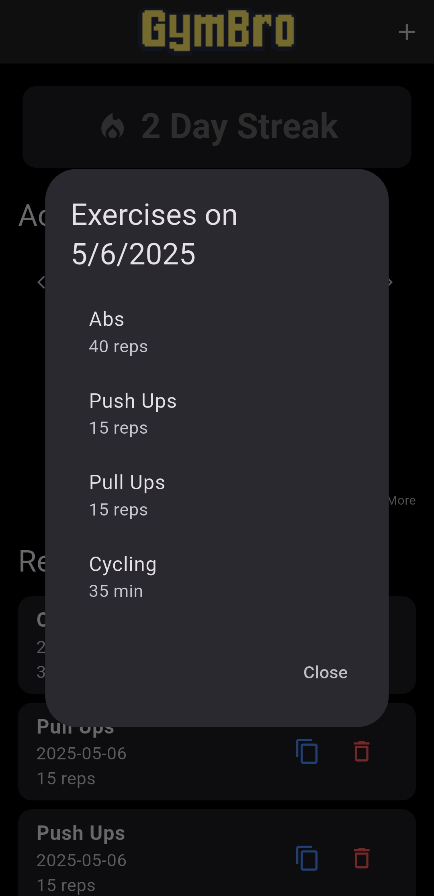

<p align="center">
  
</p>

<h1 align="center">GymBro</h1>

<p align="center">A fitness tracking application that allows users to log their exercises and monitor their progress.</p>


## Features

- Log exercises with name, duration, repetitions, and notes
- Track workout streaks with a heatmap calendar
- View your current streak on the home screen
- Copy previous exercises for quick logging
- Home screen widget showing current streak (Android only)

## Screenshots

<p align="center">
  
  
  
  
</p>

## Installation

### Android

1. Download the APK from the [Releases](https://github.com/MANRAF04/GymBro/releases) section
2. Enable installation from unknown sources in your device settings
3. Open the downloaded APK to install

### iOS

Clone the repository and build using Xcode:

```bash
git clone https://github.com/MANRAF04/GymBro.git
cd GymBro
flutter run
